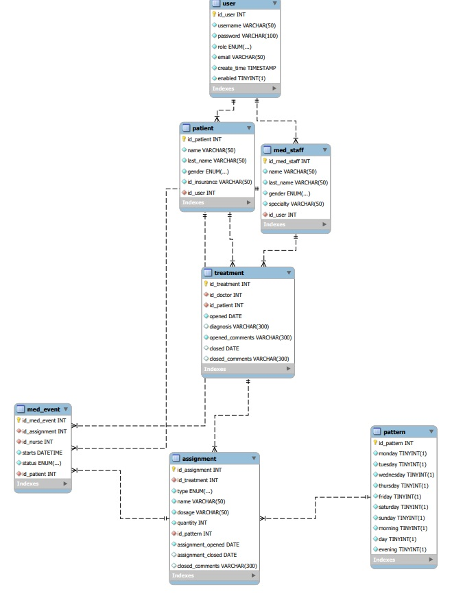

# TSD
##Introduction
This client-server application helps manage rehabilitaion
clinic.
##User stories
    * As a doctor I should be able to add new patient to application.
    Application should save patient for further reference.

    * As a nurse I should be able to view today's events, and be able to 
    modify their state by cancelling them or marking them done
## Tech stack
* IDE -  IDEA
* Tomcat
* DB – MySQL
* Maven
* JPA
* Spring Framework
* JSP

## Data model

##App architecture
Application uses MVC architecture.

##Further improvements
* Add schedule to data model and schedule support for business logic.
This would help distribute events between staff based on their schedules.

* Add patient service that would help them remotely cancel or send a ticket to place event for another time

* Add email confirmation support